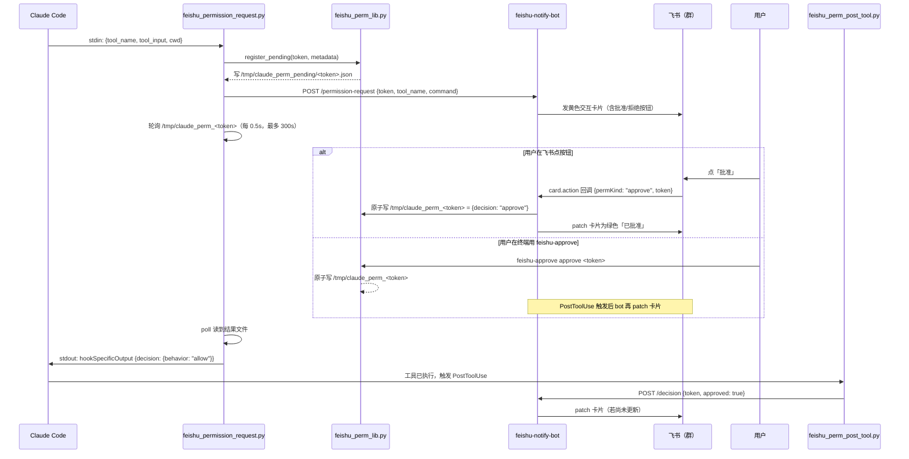
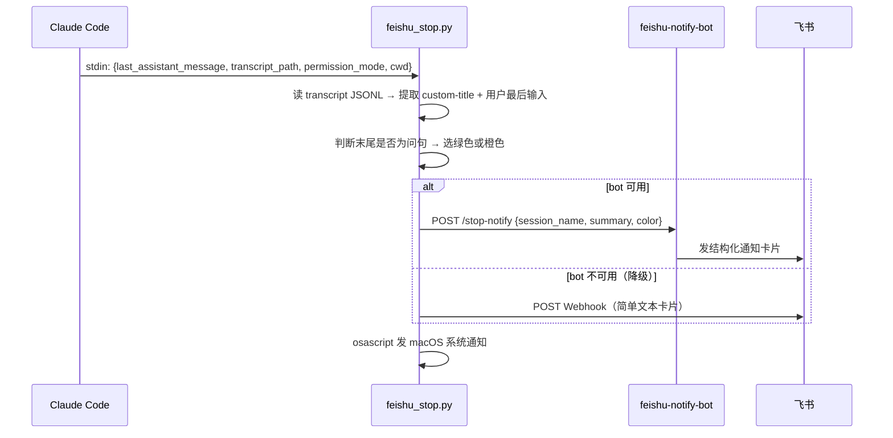
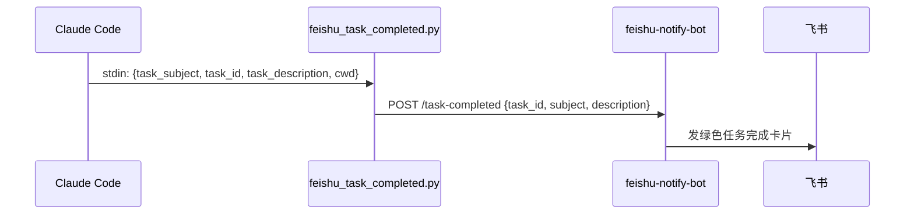

# ARCHITECTURE — 系统架构与设计

> **AI-Notify (for Feishu/Lark)**：本文面向架构师，完整描述系统组件、数据流和核心设计决策。
>
> 安装使用请看 [USER_GUIDE.md](./USER_GUIDE.md)，扩展开发请看 [DEVELOPER.md](./DEVELOPER.md)。

---

## 设计目标与约束

| 目标 | 说明 |
|------|------|
| **离线感知** | 用户离开终端，手机也能收到 AI 状态通知 |
| **低延迟批准** | 飞书点按钮后，Claude 30 秒内收到决策 |
| **不侵入 Claude Code 本体** | 纯 Hook 机制，不 patch Claude 二进制 |
| **可降级** | bot 不可用时，通知类能降级走 Webhook（不中断权限流程）|

---

## 组件全景

```
┌─────────────────────────────────────────────────────────┐
│  Claude Code / Cursor IDE                               │
│  ┌──────────┐  ┌──────────────┐  ┌──────────────────┐  │
│  │ Stop     │  │ Permission   │  │ TaskCompleted    │  │
│  │ hook     │  │ Request hook │  │ hook             │  │
│  └────┬─────┘  └──────┬───────┘  └────────┬─────────┘  │
└───────┼────────────────┼───────────────────┼────────────┘
        │                │                   │
        ▼                ▼                   ▼
   feishu_stop.py  feishu_permission_   feishu_task_
                   request.py           completed.py
        │                │                   │
        │         ┌──────┴──────┐            │
        │         │ feishu_     │            │
        │         │ perm_lib.py │            │
        │         │ (决策总线)  │            │
        │         └──────┬──────┘            │
        │                │                   │
        ▼                ▼                   ▼
   ┌─────────────────────────────────────────────┐
   │         feishu-notify-bot (:13380)          │
   │  HTTP API → 飞书 OpenAPI → 互动卡片         │
   └─────────────────────┬───────────────────────┘
                         │
                    飞书群 / 私聊
                         │
                    用户点按钮
                         │
                    card.action 回调
                         │
                    写入 /tmp/claude_perm_<token>
                         │
                    feishu_perm_lib.py poll 读到结果
                         │
                    hookSpecificOutput → Claude 继续
```

| 组件 | 技术 | 职责 |
|------|------|------|
| Python hooks | Python 3.9+ | 监听 Claude 生命周期事件，通过 symlink 挂载 |
| feishu-notify-bot | Node.js 18+ | 发飞书互动卡片、收按钮回调、协调决策 |
| 决策总线 | `/tmp` 文件 | Hook ↔ Bot ↔ CLI 三方通信 |
| feishu-approve CLI | Bash | 终端备用批准入口 |

---

## 完整数据流

### PermissionRequest（最复杂，含交互）



### Stop（纯通知，无阻塞）



### TaskCompleted



---

## 决策总线设计

核心原则：**first-writer-wins**（先写入者生效，后写入者无效）。

| 文件路径 | 写入方 | 内容 | 作用 |
|----------|--------|------|------|
| `/tmp/claude_perm_<token>` | Bot / feishu-approve | `{decision, source, updatedInput?}` | 最终决策结果 |
| `/tmp/claude_perm_pending/<token>.json` | feishu_perm_lib.py | `{tool_name, command, cwd, questions?}` | 待处理元数据，供 PostToolUse 匹配 |
| `/tmp/claude_perm_latest.txt` | feishu_perm_lib.py | `<token>` | feishu-approve 无参时的默认 token |
| `/tmp/claude_perm_cards/<token>.json` | feishu-notify-bot | `{messageId}` | 卡片 ID，bot 重启后仍可 patch |

**原子写入**：使用 `O_CREAT|O_EXCL` 标志打开决策文件，保证并发下只有第一个写入者成功。飞书点按钮、`feishu-approve`、终端 PostToolUse——三者竞争写入，先到先得。

**Token 生成**：hook 端使用 `uuid.uuid4().hex`，bot 端使用 `crypto.randomUUID().replace(/-/g, '')`，两者均产生 32 位十六进制字符串。

**超时**：`PermissionRequest` hook 最长等待 300 秒（`POLL_TIMEOUT`）。超时后输出 `deny`，Claude 拒绝执行该工具。

---

## 降级策略

```
bot 健康检查         → POST /stop-notify（结构化卡片）
                      ↓ 失败
Webhook 地址可用     → POST Webhook（简单文本通知）
                      ↓ 失败
macOS               → osascript 系统通知
```

> **权限批准流程不降级**：bot 不可用时，PermissionRequest hook 等待超时后直接返回 deny，不会降级为「自动批准」——这是设计安全边界的有意选择。

---

## 安全考量

| 风险 | 缓解措施 |
|------|----------|
| 凭证泄露 | `config.json` 在 `.gitignore` 中；文档禁止硬编码凭证 |
| 卡片回调伪造 | 飞书卡片回调签名验证（bot 侧实现） |
| Admin API 未授权访问 | `admin.token` 保护，仅内网访问 |
| 决策文件被第三方程序修改 | `/tmp` 路径+token 保证随机性；token 由 `uuid.uuid4().hex` 生成 |

---

## 技术栈

| 层 | 技术 | 版本 |
|----|------|------|
| Hook 脚本 | Python | 3.9+ |
| Bot 服务 | Node.js + http 模块 | 18+ |
| 进程管理 | pm2 | 任意 |
| 通知渠道 | 飞书 OpenAPI v2 | — |
| 系统通知 | macOS osascript | — |
| 进程间通信 | 本地文件系统 `/tmp` | — |
