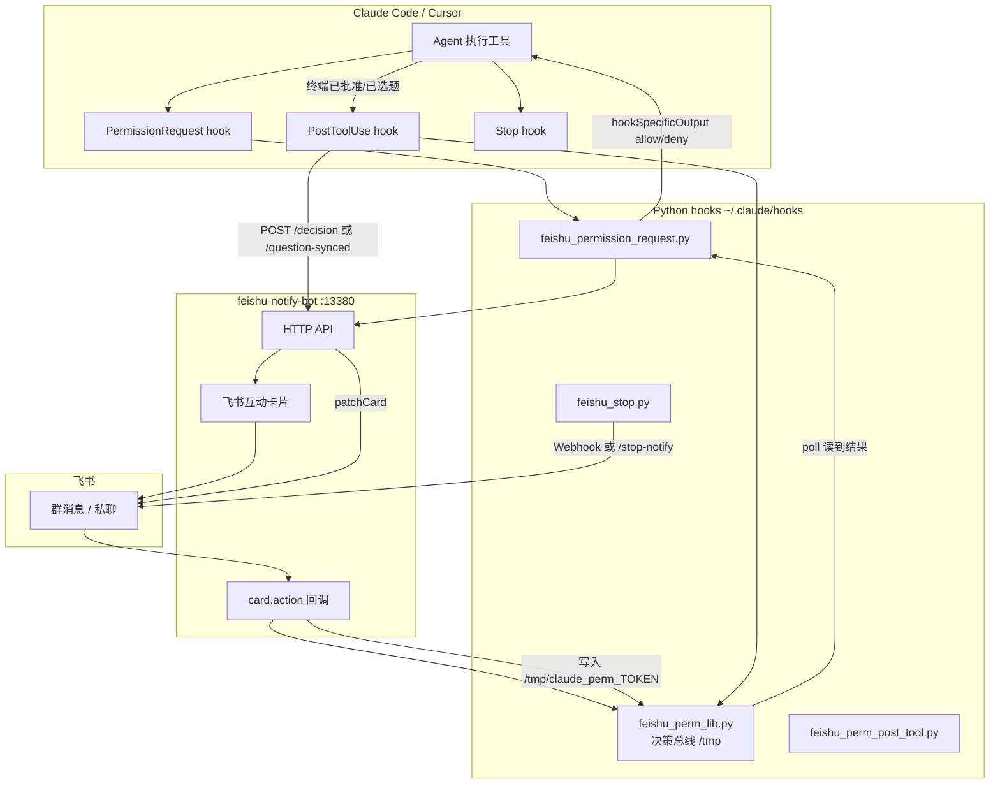

> **文档已拆分。** 本文内容已整合到以下文档中，建议直接查阅新版：
>
> - 安装与使用 → [USER_GUIDE.md](./USER_GUIDE.md)
> - 系统架构 → [ARCHITECTURE.md](./ARCHITECTURE.md)
> - 研发扩展 → [DEVELOPER.md](./DEVELOPER.md)
>
> 本文保留作为历史参考，不再主动维护。

---

# feishu-notify 完整指南

面向两类读者：

1. **只想用**：按 [快速安装](#快速安装) 配好即可在飞书收通知、点按钮批权限。
2. **想自己实现**：按 [架构与数据流](#架构与数据流) + [自己动手实现](#自己动手实现) 复刻或改成 Slack / 企业微信等。

> 用户向速览见 [README.md](./README.md)。本文件是 **feishu-notify + feishu-notify-bot** 的设计说明与运维手册。

---

## 能力矩阵

| 能力 | 仅 Webhook（3 个 Python hook） | + feishu-notify-bot | Claude Code | Cursor IDE |
|------|-------------------------------|---------------------|-------------|------------|
| 回合结束通知（Stop） | ✅ | ✅ 可走 bot `/stop-notify` | ✅ `Stop` hook | ✅ `stop` hook（需改 stdin 字段） |
| 任务完成（TaskCompleted） | ✅ | ✅ | ✅ | ❌ 无同名事件 |
| Bash 等权限：飞书批准/拒绝 | ❌ 仅提醒 | ✅ 交互卡片 | ✅ `PermissionRequest` | ⚠️ 需移植到 `beforeShellExecution` / `preToolUse` |
| AskUserQuestion 选项卡片 | ❌ | ✅ | ✅ | ⚠️ 无同名工具，需另做交互 |
| 终端批准后飞书卡片同步 | ❌ | ✅ `POST /decision` | ✅ `PostToolUse` | ⚠️ 有 `postToolUse`，payload 不同 |
| 终端选题后飞书同步 | ❌ | ✅ `POST /question-synced` | ✅ | ⚠️ 需自研 |

**结论**：当前仓库按 **Claude Code** 的 Hook 体系完整实现；**Cursor 可用通知类能力，权限/选题需按 Cursor Hook 文档单独适配**（见 [Cursor 能用吗](#cursor-能用吗)）。

---

## 架构与数据流



### 核心设计：决策总线（first writer wins）

| 路径 | 文件 | 作用 |
|------|------|------|
| 决策结果 | `/tmp/claude_perm_<token>` | JSON：`approve` / `deny` / `answer` + `source` + 可选 `updatedInput` |
| 待处理登记 | `/tmp/claude_perm_pending/<token>.json` | 工具名、命令、cwd、questions 等，供 PostToolUse 匹配 |
| 最新 token | `/tmp/claude_perm_latest.txt` | `feishu-approve` 省略 token 时用 |
| 卡片元数据 | `/tmp/claude_perm_cards/<token>.json` | bot 侧 messageId，bot 重启后仍可 patch |

**原则**：飞书点按钮、终端 `feishu-approve`、Claude 终端内点批准、PostToolUse 同步——谁先原子写入结果文件，谁生效；另一方只更新 UI 或 noop。

---

## 快速安装

### 0. 前置条件

- macOS 或 Linux，**Python 3.9+**
- [Claude Code](https://claude.ai/code)（完整权限/选题流程）
- 飞书：**自定义机器人 Webhook**（仅通知）或 **企业自建应用**（交互卡片，需 bot）
- Node.js 18+（仅 bot）

### 1. 克隆并链接触发脚本

```bash
REPO=~/Projects/github/agent-skills/feishu-notify   # 改成你的路径
mkdir -p ~/.claude/hooks ~/.local/bin

ln -sf "$REPO/hooks/feishu_perm_lib.py"           ~/.claude/hooks/
ln -sf "$REPO/hooks/feishu_permission_request.py" ~/.claude/hooks/
ln -sf "$REPO/hooks/feishu_perm_post_tool.py"     ~/.claude/hooks/
ln -sf "$REPO/hooks/feishu_stop.py"                ~/.claude/hooks/
ln -sf "$REPO/hooks/feishu_task_completed.py"      ~/.claude/hooks/
ln -sf "$REPO/bin/feishu-approve"                 ~/.local/bin/feishu-approve
chmod +x ~/.local/bin/feishu-approve
```

把 `feishu_stop.py`、`feishu_task_completed.py`、`feishu_permission_request.py` 顶部的 `WEBHOOK` 换成你的群机器人地址（或统一改为读环境变量 `FEISHU_WEBHOOK`）。

### 2. 配置 Claude Code（`~/.claude/ft-settings.json`）

在 `hooks` 中注册（**timeout 权限 hook 建议 ≥ 310 秒**）：

```json
{
  "skipAutoPermissionPrompt": true,
  "permissions": {
    "allow": ["Read", "Glob", "Grep", "Edit", "Write", "..."],
    "ask": ["Bash(git push *)", "Bash(rm *)", "..."],
    "deny": [],
    "defaultMode": "auto"
  },
  "hooks": {
    "Stop": [{
      "matcher": ".*",
      "hooks": [{ "type": "command", "command": "python3 ~/.claude/hooks/feishu_stop.py", "timeout": 10 }]
    }],
    "TaskCompleted": [{
      "matcher": ".*",
      "hooks": [{ "type": "command", "command": "python3 ~/.claude/hooks/feishu_task_completed.py", "timeout": 10 }]
    }],
    "PermissionRequest": [{
      "matcher": "Bash|Edit|Write|MultiEdit|NotebookEdit|AskUserQuestion",
      "hooks": [{
        "type": "command",
        "command": "python3 ~/.claude/hooks/feishu_permission_request.py",
        "timeout": 310,
        "statusMessage": "等待飞书批准..."
      }]
    }],
    "PostToolUse": [{
      "matcher": "Bash|Edit|Write|MultiEdit|NotebookEdit|AskUserQuestion",
      "hooks": [{
        "type": "command",
        "command": "python3 ~/.claude/hooks/feishu_perm_post_tool.py",
        "timeout": 5
      }]
    }]
  }
}
```

说明：

- `skipAutoPermissionPrompt: true`：终端不再弹第二套批准框，**飞书 / `feishu-approve` / 终端内首次点击** 三选一即可（与卡片文案「二选一」一致）。
- `defaultMode: "auto"`：见下文 [自动模式](#自动模式减少确认)。

### 3. 启动 feishu-notify-bot

```bash
cd "$REPO/bot"
cp config.example.json config.json
# 填写 feishu.appId、appSecret、targets 或 group.chatId
npm install
node src/server.js
# 默认 http://localhost:13380
```

健康检查：

```bash
curl -s http://localhost:13380/health
```

环境变量（可选）：

| 变量 | 默认 | 含义 |
|------|------|------|
| `FEISHU_NOTIFY_BOT_URL` | `http://localhost:13380` | Python hook 调 bot 的基址 |
| `FEISHU_WEBHOOK` | 脚本内常量 | 仅 Webhook 模式的通知地址 |

### 通知发到群还是私聊？

| 类型 | 默认发送位置 |
|------|----------------|
| 批准/拒绝卡（`permission-request`） | **优先 `group.chatId` 群** |
| 选题卡（`ask-user-request`） | 群（或 `targets.receiveId`） |
| 回合结束（`stop-notify`） | 群 |
| `permission_prompt` 提醒（Notification hook） | 群 |

若只在私聊里找批准卡，会以为「飞书没通知」。

### 4. 飞书应用（交互卡片必做）

1. [飞书开放平台](https://open.feishu.cn/) 创建企业自建应用。
2. 开通权限：`im:message`、`im:message:send_as_bot`、卡片相关权限。
3. 配置 **事件订阅** → `card.action.trigger`（bot 内 `webhook-handler.js` 处理按钮）。
4. 把 bot 拉进目标群，`config.json` 里填 `group.chatId` 或 `targets.receiveId`。

`config.example.json` 字段说明见 [bot/README.md](./bot/README.md)。

### 5. 验证

```bash
bash "$REPO/scripts/validate-permission-flow.sh"
```

通过后 **重启 Claude Code**，在会话里触发一次 `permissions.ask` 里的命令或 AskUserQuestion，确认飞书卡片与终端二选一可用。

---

## feishu-notify-bot

Node 侧车服务：负责 **发互动卡片、收按钮回调、patch 已决策状态**。Python hook 只做阻塞等待与 stdin/stdout 协议，不直接调飞书 OpenAPI（除降级 Webhook 提醒）。

### HTTP API

| 方法 | 路径 | 调用方 | 说明 |
|------|------|--------|------|
| POST | `/permission-request` | `feishu_permission_request.py` | Bash 等：批准/拒绝按钮 |
| POST | `/ask-user-request` | 同上 | AskUserQuestion：选项 + 元操作按钮 |
| POST | `/decision` | `feishu_perm_post_tool.py` / `feishu-approve` | 终端已批准 → 卡片变绿/红 |
| POST | `/question-synced` | `feishu_perm_post_tool.py` | 终端已选题 → 卡片「已作答」 |
| POST | `/ask-user-notify` | 降级 | bot 不可用时的纯提醒卡 |
| POST | `/stop-notify` | `feishu_stop.py`（可选） | 结构化 Stop 卡片 |
| POST | `/task-completed` | task hook（可选） | 任务完成卡 |
| POST | `/ding` | permission hook 定时 | 2 分钟未批 @ 提醒 |
| GET | `/health` | 运维 | 存活与 WS 状态 |

### 卡片回调（`permKind`）

| permKind | 行为 |
|----------|------|
| （默认）`approve` / `deny` | 写 `/tmp/claude_perm_<token>` 为 approve/deny |
| `answer` | 选题：`qi` + `idx` → 写 `decision: answer` + `updatedInput` |
| `meta` | 「Chat about this」「Skip interview」等元操作 |

### 部署建议

- 本机开发：`node src/server.js`，Claude 与 bot 同机。
- 长期运行：`pm2` / `launchd` / systemd，日志例如 `/tmp/feishu-bot.log`。
- 修改 `bot/` 后需 **重启进程**；`hooks/` 为 symlink 时 **无需重启** Claude，保存即生效。

---

## 自己动手实现

若不用本仓库，可按下面最小闭环自建（任意通知渠道）。

### 第一步：Hook 能阻塞并返回 allow/deny

Claude Code `PermissionRequest` hook 必须向 **stdout** 打印：

```json
{
  "hookSpecificOutput": {
    "hookEventName": "PermissionRequest",
    "decision": { "behavior": "allow" }
  }
}
```

或 `deny` + `message`。禁止只打印 `{"decision":"approve"}`（旧格式无效）。

AskUserQuestion 允许时带上选题结果：

```json
{
  "decision": {
    "behavior": "allow",
    "updatedInput": {
      "questions": [ ... ],
      "answers": { "问题全文": "所选选项 label" }
    }
  }
}
```

Hook 内典型循环：

```python
register_pending(token, ...)
send_notification_to_mobile(token, ...)   # 你的飞书/Slack/HTTP
while time.time() < deadline:
    result = consume_result(token)      # 读 /tmp 并删除
    if result:
        if result["decision"] == "approve":
            hook_output_allow()
        elif result["decision"] == "answer":
            hook_output_allow(result["updatedInput"])
        ...
    time.sleep(0.5)
hook_output_deny("timeout")
```

### 第二步：移动端写回决策

飞书按钮 → 你的服务 → **原子创建** `/tmp/claude_perm_<token>`（`O_CREAT|O_EXCL`），避免重复批准。

终端 CLI 同理：`feishu-approve approve [token]`。

### 第三步：终端与移动端 UI 一致（可选）

工具**已执行**后，用 `PostToolUse` 根据 `tool_input`（含 `command` 或 `answers`）匹配 pending，调用你的服务 **只更新卡片文案**，不必再改 Claude 决策。

### 第四步：仅通知、不阻塞

`feishu_stop.py` 模式：读 stdin JSON → 拼卡片 → `POST` Webhook，**不**占满 PermissionRequest。适合「人不在电脑前也要知道跑完了」。

### 可替换组件

| 本仓库组件 | 可换成 |
|------------|--------|
| 飞书互动卡片 | Slack Block Kit、钉钉、Telegram Bot、邮件 |
| `/tmp` 文件总线 | Redis、SQLite、你自己的 HTTP 长轮询 |
| feishu-notify-bot | 任意能收 Webhook 并发卡片的后端 |
| Python hooks | Go/Rust 脚本，只要 stdin/stdout 协议正确 |

---

## Cursor 能用吗？

**能用一部分**；要和 Claude Code **同等体验**需要适配，因为事件名与权限模型不同。

### 对照表

| Claude Code | Cursor | 本仓库现成支持 |
|-------------|--------|----------------|
| `Stop` | `stop` | 需改 `feishu_stop.py` 读 Cursor 的 stdin 字段 |
| `TaskCompleted` | （无） | 不可用 |
| `PermissionRequest` | `beforeShellExecution` / `beforeMCPExecution` / `preToolUse` | 未内置；需新脚本 |
| `PostToolUse` | `postToolUse` | 需新脚本，matcher 工具名不同（如 `Shell`） |
| `ft-settings.json` hooks | `.cursor/hooks.json` 或 `~/.cursor/hooks.json` | 配置路径不同 |

Cursor 官方 Hook 文档：[cursor.com/docs/hooks](https://cursor.com/docs/hooks.md)

### 一键安装（与 Claude Code 对齐的 auto + 飞书门控）

```bash
bash feishu-notify/cursor/install.sh
```

会安装：

- `~/.cursor/hooks.json` — `beforeShellExecution`（危险命令走飞书）、`stop` 通知、`postToolUse` 同步卡片
- `~/.cursor/cli-config.json` — `approvalMode: allowlist`，Read/Write/安全 Shell 自动批准
- `~/.cursor/hooks/*.py` — symlink 到本仓库 `feishu-notify/cursor/hooks/`

**需已启动** `feishu-notify-bot`（`:13380`），与 Claude Code 共用同一 bot。

安装后 **重启 Cursor IDE**（及正在跑的 Cursor CLI 会话）。

### 在 Cursor 里做「结束通知」（推荐先做）

项目级 `.cursor/hooks.json`：

```json
{
  "version": 1,
  "hooks": {
    "stop": [
      {
        "command": "python3 .cursor/hooks/feishu_stop_cursor.py",
        "timeout": 10
      }
    ]
  }
}
```

`feishu_stop_cursor.py`：读 Cursor `stop` 事件的 JSON（在 Cursor **Hooks 输出通道**里打一次 stdin 样本），映射到现有 Webhook 发卡片逻辑。不要照抄 Claude 的 `last_assistant_message` 字段名而不验证。

### 在 Cursor 里做「飞书批准命令」（工作量大）

思路：

1. 用 `beforeShellExecution`，`failClosed: true`。
2. 脚本内：发飞书卡片 → **同步轮询** `/tmp/claude_perm_<token>`（与现 `feishu_perm_lib` 相同）→ 超时则 `exit 2` 或 stdout `{"permission":"deny"}`。
3. 飞书 bot 仍可用本仓库 `feishu-notify-bot`，仅 Python 入口从 `feishu_permission_request.py` 换成 Cursor 专用脚本。

限制：

- Cursor 的 `preToolUse` 对 `"ask"` **目前不强制阻塞**（文档写明 schema 接受但行为未完全对齐），**壳命令批准以 `beforeShellExecution` 为主**。
- 无 Claude 的 `AskUserQuestion` PermissionRequest 时，选题卡片无对应触发点，需用 `stop` + `followup_message` 等别的方式交互。

### Cursor 配置位置

| 级别 | Hook 配置 | 工作目录 |
|------|-----------|----------|
| 项目 | `.cursor/hooks.json` | 项目根 |
| 用户 | `~/.cursor/hooks.json` | `~/.cursor/` |

改完保存后 Cursor 会自动 reload；不生效则重启 Cursor。在 **Settings → Hooks** 与 **Hooks 输出通道** 排查。

---

## 自动模式（减少确认）

要区分两件事：**哪些操作还要人批**，以及 **人批时终端还弹不弹框**。

### 1. 哪些操作需要人批（Claude Code）

在 `~/.claude/ft-settings.json` 的 `permissions` 里：

```json
"permissions": {
  "allow": [
    "Read", "Glob", "Grep", "Edit", "Write",
    "Bash(git status)", "Bash(git diff *)", "Bash(ls *)"
  ],
  "ask": [
    "Bash(git push *)",
    "Bash(rm *)",
    "Bash(sudo *)"
  ],
  "deny": ["Bash(curl *)"],
  "defaultMode": "auto"
}
```

| 字段 | 含义 |
|------|------|
| `allow` | **自动通过**，不触发 `PermissionRequest`，飞书也不会发批准卡 |
| `ask` | **必须人批**，触发 hook → 飞书卡片 / `feishu-approve` |
| `deny` | 直接拒绝 |
| `defaultMode: "auto"` | 未命中 allow/deny 时倾向自动（与 allow 列表配合） |

因此：**不是「全自动一切」**，而是 **只把危险操作放进 `ask`**，其余静默执行；你仍可只靠飞书批危险操作。

若希望 **几乎不确认**：扩大 `allow`、缩小 `ask`（安全风险自负）。若希望 **每个 Bash 都确认**：把 `Bash(*)` 放进 `ask`，或设 `defaultMode` 为更保守策略（视 Claude Code 版本文档而定）。

### 2. 人批时少弹一次终端框

```json
"skipAutoPermissionPrompt": true
```

效果：需要 `ask` 时 **不**在终端再弹一套 Allow/Deny，避免与飞书卡片重复。决策渠道：

- 飞书点按钮，或
- 另一终端 `feishu-approve approve`，或
- Claude 终端里对 AskUserQuestion 点选项（PostToolUse 会同步飞书卡片）

### 3. Cursor 的「自动跑」

与 feishu-notify **独立**，在 Cursor 侧配置：

| 产品 | 配置 | 效果 |
|------|------|------|
| **Cursor IDE** | Settings → Agent → Command allowlist / Auto-run | 白名单内命令不弹确认 |
| **Cursor CLI** | `~/.cursor/cli-config.json` → `"approvalMode": "unrestricted"` | 全部工具自动批准（俗称 yolo） |
| **Cursor CLI** | `"approvalMode": "allowlist"` + `permissions.allow` | 仅列表外需确认 |

启用 **unrestricted** 或大量 allowlist 后，**不会再走**你为「人批」写的阻塞 Hook，feishu 批准卡也就不会出现——这与 Claude 的 `permissions.allow` 逻辑类似。

**推荐组合（Claude + 飞书批危险操作）**：

- `defaultMode: "auto"` + 精简的 `ask` 列表  
- `skipAutoPermissionPrompt: true`  
- bot 常开 + `validate-permission-flow.sh` 通过  

**不推荐**：`ask` 里放很宽的模式（如 `Bash(*)`）却又想要「无感自动」——二者矛盾。

### 4. 会话级 permission_mode

Stop 卡片里的 `permission_mode`（如 `acceptEdits`、`dontAsk`）来自 Claude 会话状态，和 `ft-settings.json` 的全局 `permissions` 叠加。以当前 Claude Code 文档/界面为准。

---

## 运维与排错

| 现象 | 排查 |
|------|------|
| 完全没通知 | Webhook URL、`ft-settings.json` hooks 是否注册、是否重启 Claude |
| 有提醒无按钮 | bot 未启动、`/health` 失败、`config.json` 未配 chatId |
| 飞书批了 Claude 不动 | `/tmp/claude_perm_<token>` 是否写入；`tail -f /tmp/perm_hook_debug.log` |
| 终端批了飞书不更新 | `PostToolUse` 是否含 `AskUserQuestion` / Bash matcher；bot 是否有 `/decision`、`/question-synced` |
| Hook 立刻 timeout | `PermissionRequest` timeout 是否 ≥ 310 |
| stdin 字段全空 | 是否误用 heredoc 内联 Python（见 README） |

日志：

```bash
tail -30 /tmp/perm_hook_debug.log
```

---

## 安全提示

- 不要把 **Webhook URL、appSecret、admin token** 提交到公开仓库；用 `config.json`（gitignore）和环境变量。
- `/tmp/claude_perm_*` 为本地信任边界，多用户机器需考虑权限。
- `permissions.allow` / Cursor allowlist **不是**强安全隔离；`ask` 列表应只放真正需要人工判断的命令。

---

## 相关文件

| 文件 | 说明 |
|------|------|
| [README.md](./README.md) | 英文快速上手 |
| [CONTEXT.md](./CONTEXT.md) | 给 AI 的实现背景 |
| [bot/README.md](./bot/README.md) | Bot API 简表 |
| [scripts/validate-permission-flow.sh](./scripts/validate-permission-flow.sh) | L0–L4 自动化验证 |

---

## 常见问题

**Q：只想要「跑完发飞书」，不要批准按钮？**  
A：只装 `feishu_stop.py` + `feishu_task_completed.py` + Webhook，不启动 bot，不注册 `PermissionRequest`。

**Q：能否只用一个飞书群机器人 Webhook，不买自建应用？**  
A：Webhook 只能发消息，**不能**收按钮回调；交互批准必须用 bot（自建应用 + `card.action`）。

**Q：Linux 没有 macOS 通知？**  
A：删掉各 hook 里 `osascript` 段，或改为 `notify-send`。

**Q：多项目不同群？**  
A：按项目 `.claude/settings.local.json` 注册不同 hook 副本，或统一读 `FEISHU_WEBHOOK` / 项目名映射表。
