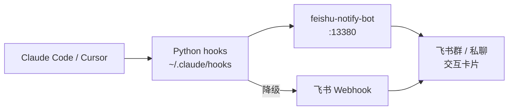

# AI-Notify (for Feishu/Lark)

> Claude Code / Cursor 执行任务时，通过飞书推送状态通知与交互卡片——让你离开终端也能感知 Agent 进度，并在飞书移动端批准权限。

[](https://opensource.org/licenses/MIT)

---

## 效果预览

> 截图待补充。安装完成后，飞书群会收到以下三种卡片：**绿色 Stop 通知**、**橙色等待回复**、**黄色权限批准卡**。

---

## 能力矩阵

> 前两列为**部署模式**（选其一），后两列为**AI 客户端**（选其一）。

| 能力 | 仅 Webhook | + feishu-notify-bot | Claude Code | Cursor IDE |
|------|:---:|:---:|:---:|:---:|
| 回合结束通知（Stop） | ✅ | ✅ | ✅ | ✅ |
| 任务完成（TaskCompleted） | ✅ | ✅ | ✅ | ❌ |
| Bash 等权限：飞书批准/拒绝 | ❌ 仅提醒 | ✅ 交互卡片 | ✅ | ⚠️ 需适配 |
| AskUserQuestion 选项卡片 | ❌ | ✅ | ✅ | ⚠️ 需适配 |
| 终端批准后飞书卡片同步 | ❌ | ✅ | ✅ | ⚠️ 需适配 |
| macOS 系统通知 | ✅ | ✅ | ✅ | ✅ |

---

## 架构概览



- **Python hooks**：监听 Claude 生命周期事件（Stop / PermissionRequest / TaskCompleted 等），通过 symlink 挂载，修改即生效无需重启。
- **feishu-notify-bot**（Node.js :13380）：发送互动卡片、接收飞书按钮回调、协调决策总线。
- **决策总线**（`/tmp` 文件）：Hook ↔ Bot ↔ CLI 三方通信，first-writer-wins 语义。

---

## 快速安装（约 5 分钟）

**前置条件**：Python 3.9+、Node.js 18+、pm2、飞书企业自建应用（需交互卡片）或自定义机器人（仅通知）。

```bash
# 1. 克隆仓库
git clone https://github.com/<your-org>/feishu-notify.git
cd feishu-notify
REPO=$(pwd)

# 2. 配置并启动 feishu-notify-bot
cd "$REPO/bot"
cp config.example.json config.json
# 编辑 config.json：填入 feishu.appId、appSecret、group.chatId
npm install
pm2 start src/server.js --name feishu-notify-bot && pm2 save

# 3. 建立 Hook symlink
mkdir -p ~/.claude/hooks ~/.local/bin
ln -sf "$REPO/hooks/feishu_perm_lib.py"           ~/.claude/hooks/
ln -sf "$REPO/hooks/feishu_permission_request.py" ~/.claude/hooks/
ln -sf "$REPO/hooks/feishu_perm_post_tool.py"     ~/.claude/hooks/
ln -sf "$REPO/hooks/feishu_stop.py"               ~/.claude/hooks/
ln -sf "$REPO/hooks/feishu_task_completed.py"     ~/.claude/hooks/
ln -sf "$REPO/hooks/feishu_notification.py"       ~/.claude/hooks/
ln -sf "$REPO/bin/feishu-approve"                 ~/.local/bin/feishu-approve
chmod +x ~/.local/bin/feishu-approve

# 4. 验证 bot 正常
curl -s http://localhost:13380/health

# 5. 注册全局 Hook（见 USER_GUIDE.md 的完整 ft-settings.json）
```

详细步骤、飞书应用配置和排障 → **[USER_GUIDE.md](./USER_GUIDE.md)**

---

## 文档导航

| 文档 | 适合谁 | 内容 |
|------|--------|------|
| [USER_GUIDE.md](./USER_GUIDE.md) | 安装使用者 | 详细安装、日常使用、排障手册 |
| [ARCHITECTURE.md](./ARCHITECTURE.md) | 架构师 | 系统设计、组件职责、完整数据流 |
| [DEVELOPER.md](./DEVELOPER.md) | 研发 | Hook 开发、Bot API、扩展指引 |
| [ROADMAP.md](./ROADMAP.md) | 所有人 | 当前版本状态与演进路线 |

---

## License

MIT
