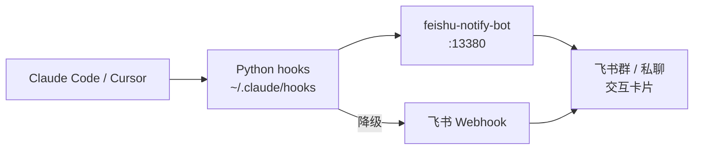
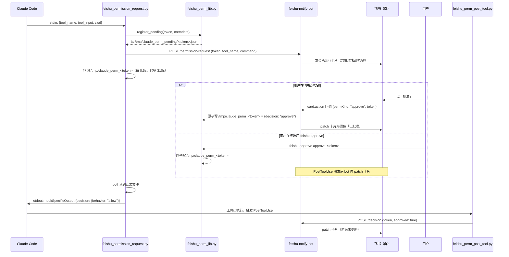
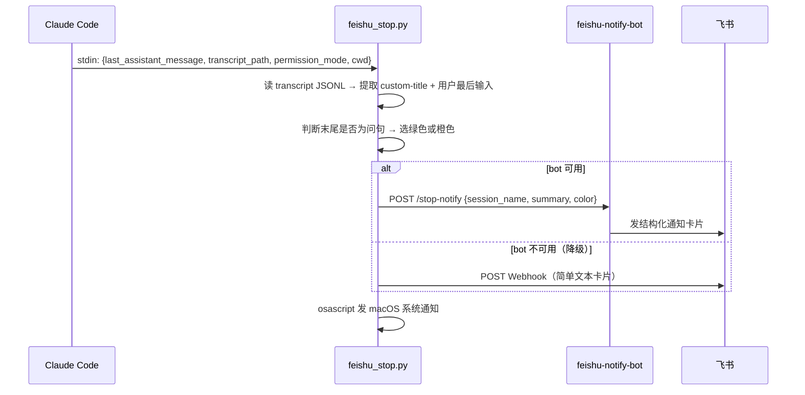
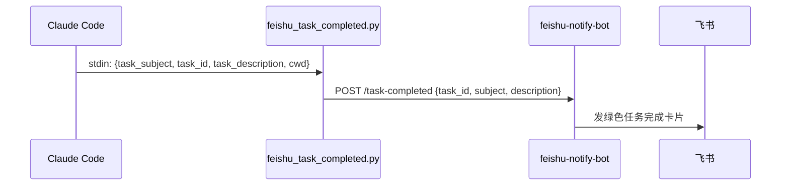

# AI-Notify Product Docs Implementation Plan

> **For agentic workers:** REQUIRED SUB-SKILL: Use superpowers:subagent-driven-development (recommended) or superpowers:executing-plans to implement this plan task-by-task. Steps use checkbox (`- [ ]`) syntax for tracking.

**Goal:** 为 feishu-notify 写一套完整的产品文档（五件套），同时服务用户、架构师和研发。

**Architecture:** 五个独立 Markdown 文件，放在 `feishu-notify/` 根目录，各文件职责单一不重叠。现有 GUIDE.md 内容拆入 USER_GUIDE.md + ARCHITECTURE.md 后保留重定向声明，CONTEXT.md 保持不动（AI agent 专用）。

**Tech Stack:** Markdown、Mermaid 图表

**Spec:** `docs/superpowers/specs/2026-05-25-product-docs-design.md`

---

## File Structure

```
feishu-notify/
├── README.md              # 重写：产品名片（~120 行）
├── USER_GUIDE.md          # 新建：用户安装与使用（~350 行）
├── ARCHITECTURE.md        # 新建：系统架构与设计（~250 行）
├── DEVELOPER.md           # 新建：研发扩展指引（~350 行）
├── ROADMAP.md             # 新建：版本状态与路线图（~120 行）
└── GUIDE.md               # 修改：顶部加重定向声明，正文保留
```

---

## Task 1: 重写 README.md（产品名片）

**Files:**
- Modify: `README.md`

- [ ] **Step 1：备份原文件**

```bash
cp /Users/admin/Projects/github/agent-skills/feishu-notify/README.md \
   /Users/admin/Projects/github/agent-skills/feishu-notify/README.md.bak
```

- [ ] **Step 2：写入新 README.md**

写入以下完整内容（替换原文件）：

```markdown
# AI-Notify (for Feishu/Lark)

> Claude Code / Cursor 执行任务时，通过飞书推送状态通知与交互卡片——让你离开终端也能感知 Agent 进度，并在飞书移动端批准权限。

[](./LICENSE)

---

## 效果预览

| Stop 通知（任务完成） | 等待回复（橙色） | 权限批准（交互卡）|
|---|---|---|
|  |  |  |

> 截图位置：`docs/assets/`，可按实际截图替换。

---

## 能力矩阵

| 能力 | 仅 Webhook | + feishu-notify-bot | Claude Code | Cursor IDE |
|------|:---:|:---:|:---:|:---:|
| 回合结束通知（Stop） | ✅ | ✅ | ✅ | ✅ |
| 任务完成（TaskCompleted） | ✅ | ✅ | ✅ | ❌ |
| Bash 等权限：飞书批准/拒绝 | ❌ 仅提醒 | ✅ 交互卡片 | ✅ | ⚠️ 需适配 |
| AskUserQuestion 选项卡片 | ❌ | ✅ | ✅ | ⚠️ 需适配 |
| 终端批准后飞书卡片同步 | ❌ | ✅ | ✅ | ⚠️ 需适配 |
| macOS 系统通知 | ✅ | ✅ | ✅ | ✅ |

---

## 架构概览



- **Python hooks**：监听 Claude 生命周期事件（Stop / PermissionRequest / TaskCompleted 等），通过 symlink 挂载，修改即生效无需重启。
- **feishu-notify-bot**（Node.js :13380）：发送互动卡片、接收飞书按钮回调、协调决策总线。
- **决策总线**（`/tmp` 文件）：Hook ↔ Bot ↔ CLI 三方通信，first-writer-wins 语义。

---

## 快速安装（约 5 分钟）

**前置条件**：Python 3.9+、Node.js 18+、pm2、飞书企业自建应用（需交互卡片）或自定义机器人（仅通知）。

```bash
# 1. 克隆仓库
git clone https://github.com/<your-org>/feishu-notify.git
REPO=$(pwd)/feishu-notify

# 2. 配置并启动 feishu-notify-bot
cd "$REPO/bot"
cp config.example.json config.json
# 编辑 config.json：填入 feishu.appId、appSecret、group.chatId
npm install
pm2 start src/server.js --name feishu-notify-bot && pm2 save

# 3. 建立 Hook symlink
mkdir -p ~/.claude/hooks ~/.local/bin
ln -sf "$REPO/hooks/feishu_perm_lib.py"           ~/.claude/hooks/
ln -sf "$REPO/hooks/feishu_permission_request.py" ~/.claude/hooks/
ln -sf "$REPO/hooks/feishu_perm_post_tool.py"     ~/.claude/hooks/
ln -sf "$REPO/hooks/feishu_stop.py"               ~/.claude/hooks/
ln -sf "$REPO/hooks/feishu_task_completed.py"     ~/.claude/hooks/
ln -sf "$REPO/hooks/feishu_notification.py"       ~/.claude/hooks/
ln -sf "$REPO/bin/feishu-approve"                 ~/.local/bin/feishu-approve
chmod +x ~/.local/bin/feishu-approve

# 4. 验证 bot 正常
curl -s http://localhost:13380/health

# 5. 注册全局 Hook（见 USER_GUIDE.md 的完整 ft-settings.json）
```

详细步骤、飞书应用配置和排障 → **[USER_GUIDE.md](./USER_GUIDE.md)**

---

## 文档导航

| 文档 | 适合谁 | 内容 |
|------|--------|------|
| [USER_GUIDE.md](./USER_GUIDE.md) | 安装使用者 | 详细安装、日常使用、排障手册 |
| [ARCHITECTURE.md](./ARCHITECTURE.md) | 架构师 | 系统设计、组件职责、完整数据流 |
| [DEVELOPER.md](./DEVELOPER.md) | 研发 | Hook 开发、Bot API、扩展指引 |
| [ROADMAP.md](./ROADMAP.md) | 所有人 | 当前版本状态与演进路线 |

---

## License

MIT
```

- [ ] **Step 3：删除备份**

```bash
rm /Users/admin/Projects/github/agent-skills/feishu-notify/README.md.bak
```

- [ ] **Step 4：对照验收标准自查**

确认：
- 陌生人 30 秒内能看懂这是什么
- 能力矩阵与 GUIDE.md 第一张表一致
- 快速安装步骤可以跑通
- 四个文档链接都正确

- [ ] **Step 5：Commit**

```bash
cd /Users/admin/Projects/github/agent-skills/feishu-notify
git add README.md
git commit -m "docs: rewrite README as product card (AI-Notify)"
```

---

## Task 2: 新建 USER_GUIDE.md（用户安装与使用指南）

**Files:**
- Create: `USER_GUIDE.md`

- [ ] **Step 1：写入 USER_GUIDE.md**

```markdown
# USER_GUIDE — 安装与使用指南

> **AI-Notify (for Feishu/Lark)**：本文是面向最终用户的完整指南——从零开始安装、日常使用、以及排查问题。
>
> 架构设计请看 [ARCHITECTURE.md](./ARCHITECTURE.md)，扩展开发请看 [DEVELOPER.md](./DEVELOPER.md)。

---

## 前置条件

| 依赖 | 最低版本 | 用途 |
|------|----------|------|
| macOS 或 Linux | — | Hook 脚本和系统通知 |
| Python | 3.9+ | Hook 脚本运行环境 |
| Node.js | 18+ | feishu-notify-bot |
| pm2 | 任意 | bot 长期运行 |
| Claude Code | 任意 | Hook 挂载点 |
| 飞书企业自建应用 | — | 交互卡片（批准权限必须） |

> 若只需要**通知**（不需要飞书按钮批准），可用飞书**自定义机器人 Webhook**，无需企业自建应用和 bot。

---

## 安装步骤

### 步骤 1：克隆仓库

```bash
git clone https://github.com/<your-org>/feishu-notify.git
cd feishu-notify
REPO=$(pwd)   # 后续步骤用到这个变量
```

### 步骤 2：配置飞书应用

**方式 A：企业自建应用（推荐，支持交互卡片）**

1. 进入 [飞书开放平台](https://open.feishu.cn/) → 创建企业自建应用
2. 开通以下权限：
   - `im:message`
   - `im:message:send_as_bot`
   - `im:message.group_msg:create`（发群消息）
3. 配置事件订阅 → 添加事件 `card.action.trigger`
4. 在「安全设置」里配置 **事件请求地址**：`http://<你的机器IP>:13380/feishu-callback`
   > 本机开发时，飞书回调需要公网可达。可用 frp/ngrok 做内网穿透，或使用飞书「本地调试」模式。
5. 把机器人拉入目标飞书群
6. 记录 `appId`、`appSecret`、群的 `chatId`（在飞书群右键 → 复制链接，ID 在 URL 中）

**方式 B：自定义机器人 Webhook（仅通知，无法点按钮批准）**

在飞书群 → 群设置 → 机器人 → 添加机器人 → 自定义机器人，复制 Webhook 地址。

### 步骤 3：配置并启动 feishu-notify-bot

```bash
cd "$REPO/bot"
cp config.example.json config.json
```

编辑 `config.json`，填入你的值：

```json
{
  "feishu": {
    "appId": "cli_xxxxxxxxxxxxxxxx",
    "appSecret": "xxxxxxxxxxxxxxxxxxxxxxxxxxxxxxxx"
  },
  "group": {
    "chatId": "oc_xxxxxxxxxxxxxxxxxxxxxxxxxxxxxxxx"
  },
  "server": {
    "port": 13380
  },
  "admin": {
    "token": "your-admin-token-here"
  }
}
```

> **安全提醒**：`config.json` 已在 `.gitignore` 中，勿提交凭证。

```bash
npm install
# 测试运行（Ctrl+C 退出后再用 pm2）
node src/server.js

# 确认健康检查通过后，用 pm2 长期运行
pm2 start src/server.js --name feishu-notify-bot
pm2 save
pm2 startup   # 跟随提示设置开机自启
```

验证：

```bash
curl -s http://localhost:13380/health
# 期望输出：{"status":"ok", ...}
```

### 步骤 4：建立 Hook symlink

```bash
mkdir -p ~/.claude/hooks ~/.local/bin

ln -sf "$REPO/hooks/feishu_perm_lib.py"           ~/.claude/hooks/
ln -sf "$REPO/hooks/feishu_permission_request.py" ~/.claude/hooks/
ln -sf "$REPO/hooks/feishu_perm_post_tool.py"     ~/.claude/hooks/
ln -sf "$REPO/hooks/feishu_stop.py"               ~/.claude/hooks/
ln -sf "$REPO/hooks/feishu_task_completed.py"     ~/.claude/hooks/
ln -sf "$REPO/hooks/feishu_notification.py"       ~/.claude/hooks/
ln -sf "$REPO/bin/feishu-approve"                 ~/.local/bin/feishu-approve
chmod +x ~/.local/bin/feishu-approve
```

验证 symlink：

```bash
ls -la ~/.claude/hooks/ | grep feishu
# 应能看到 6 个 -> .../feishu-notify/hooks/ 的链接
```

### 步骤 5：注册全局 Hook（`~/.claude/ft-settings.json`）

编辑（或创建）`~/.claude/ft-settings.json`，加入以下 `hooks` 配置（与现有内容合并）：

```json
{
  "skipAutoPermissionPrompt": true,
  "permissions": {
    "allow": [
      "Read", "Glob", "Grep", "Edit", "Write", "MultiEdit", "NotebookEdit",
      "Bash(git status)", "Bash(git diff *)", "Bash(git log *)",
      "Bash(ls *)", "Bash(cat *)", "Bash(echo *)"
    ],
    "ask": [
      "Bash(git push *)",
      "Bash(rm *)",
      "Bash(sudo *)"
    ],
    "deny": [],
    "defaultMode": "auto"
  },
  "hooks": {
    "Stop": [{
      "matcher": ".*",
      "hooks": [{
        "type": "command",
        "command": "python3 ~/.claude/hooks/feishu_stop.py",
        "timeout": 10
      }]
    }],
    "TaskCompleted": [{
      "matcher": ".*",
      "hooks": [{
        "type": "command",
        "command": "python3 ~/.claude/hooks/feishu_task_completed.py",
        "timeout": 10
      }]
    }],
    "PermissionRequest": [{
      "matcher": "Bash|Edit|Write|MultiEdit|NotebookEdit|AskUserQuestion",
      "hooks": [{
        "type": "command",
        "command": "python3 ~/.claude/hooks/feishu_permission_request.py",
        "timeout": 310,
        "statusMessage": "等待飞书批准..."
      }]
    }],
    "PostToolUse": [{
      "matcher": "Bash|Edit|Write|MultiEdit|NotebookEdit|AskUserQuestion",
      "hooks": [{
        "type": "command",
        "command": "python3 ~/.claude/hooks/feishu_perm_post_tool.py",
        "timeout": 5
      }]
    }],
    "Notification": [{
      "matcher": ".*",
      "hooks": [{
        "type": "command",
        "command": "python3 ~/.claude/hooks/feishu_notification.py",
        "timeout": 10
      }]
    }]
  }
}
```

**关键说明**：
- `skipAutoPermissionPrompt: true`：需要批准时，终端不再弹第二套 Allow/Deny 框，避免与飞书卡片重复。只需在飞书点按钮 **或** 终端运行 `feishu-approve approve`，二选一即可。
- `PermissionRequest` 的 `timeout: 310`：给飞书卡片批准留足 5 分钟等待时间。
- `defaultMode: "auto"`：未命中 allow/deny 时倾向自动执行；只有 `ask` 列表中的命令才触发飞书卡片。

### 步骤 6：端到端验证

```bash
bash "$REPO/scripts/validate-permission-flow.sh"
```

全部 L0–L5 通过后，重启 Claude Code，在会话里触发一个 `ask` 列表中的命令（如 `git push`），确认飞书群里出现批准卡片。

---

## 日常使用

### 通知卡片说明

| 卡片类型 | 触发时机 | 颜色 | 可操作 |
|----------|----------|------|--------|
| **Stop（绿）** | 每轮 AI 回复结束 | 绿色 | 否 |
| **Stop（橙）** | AI 回复末尾是问句 | 橙色「等待回复」 | 否 |
| **TaskCompleted** | Task 标记 completed | 绿色 | 否 |
| **PermissionRequest** | Bash/Edit/Write 等需批准 | 黄色「审批」 | ✅ 批准 / 拒绝 |
| **AskUserQuestion** | Claude 向你提问 | 黄色「选题」 | ✅ 选项按钮 |

### 在飞书批准/拒绝权限

1. 飞书群里收到黄色审批卡片
2. 点击 **批准** 或 **拒绝** 按钮
3. Claude 立即收到决策，卡片自动更新为绿色/红色

> **卡片在群里，不是私聊**：批准卡默认发到 `config.json` 的 `group.chatId` 配置的群，如果你只在私聊里找，会以为没有通知。

### 在飞书回答 AskUserQuestion

1. 收到选题卡片后，点击对应选项按钮
2. Claude 接收答案并继续执行
3. 卡片更新为「已作答」状态

### feishu-approve CLI（终端备用）

当飞书不方便操作时，也可在终端完成批准：

```bash
# 查看待处理的权限请求
feishu-approve list

# 批准最新的请求
feishu-approve approve

# 批准指定 token
feishu-approve approve <token>

# 拒绝指定 token
feishu-approve deny <token>
```

### 静音某次任务

在 Claude Code 会话里对 Claude 说「这次不用发飞书通知」，或在 hook 中检查环境变量 `FEISHU_NOTIFY_SKIP=1`（需自行扩展，见 DEVELOPER.md）。

---

## Cursor IDE 支持（可选）

一键安装（与 Claude Code 共用同一个 feishu-notify-bot）：

```bash
bash "$REPO/cursor/install.sh"
```

安装后重启 Cursor IDE。

**当前 Cursor 能力对照**：

| 能力 | 状态 |
|------|------|
| 回合结束通知（stop） | ✅ 已支持 |
| 任务完成（TaskCompleted） | ❌ Cursor 无此事件 |
| Bash 权限飞书批准 | ⚠️ 部分支持（`beforeShellExecution`） |
| AskUserQuestion | ❌ Cursor 无此工具 |

详细 Cursor 适配说明见 [DEVELOPER.md → Cursor 适配](./DEVELOPER.md#cursor-适配)。

---

## 自动模式配置

如果你想让 AI 尽可能自动执行，只对危险操作触发飞书审批：

1. 把安全操作加入 `permissions.allow`（Read/Edit/git status 等）
2. 把危险操作放入 `permissions.ask`（git push/rm/sudo 等）
3. 保持 `skipAutoPermissionPrompt: true`，终端不重复弹框

**不推荐**：把 `Bash(*)` 放进 `ask`——每个命令都触发飞书卡片会非常吵。精准配置 `ask` 列表才是正确用法。

---

## 排障手册

### 快速诊断命令

```bash
# 1. bot 是否存活
curl -s http://localhost:13380/health

# 2. hook symlink 是否正确
ls -la ~/.claude/hooks/ | grep feishu

# 3. 端到端验证（需 bot 运行）
bash ~/Projects/github/agent-skills/feishu-notify/scripts/validate-permission-flow.sh

# 4. 查看 bot 日志
pm2 logs feishu-notify-bot --lines 50

# 5. 手动触发 Stop hook（无需 Claude）
echo '{"last_assistant_message":"测试","cwd":"'"$PWD"'","permission_mode":"auto","transcript_path":""}' \
  | python3 ~/.claude/hooks/feishu_stop.py
```

### 常见问题

| 现象 | 原因 | 解决 |
|------|------|------|
| 完全没通知 | Hook 未注册，或 Claude Code 未重启 | 检查 `ft-settings.json`，重启 Claude Code |
| 有通知无按钮 | bot 未启动，或 `config.json` 未配 chatId | `curl http://localhost:13380/health`；检查 `config.json` |
| 飞书批了 Claude 不动 | `/tmp/claude_perm_<token>` 未写入 | `tail -f /tmp/perm_hook_debug.log`；检查 bot 回调地址是否公网可达 |
| 终端批了飞书不更新 | PostToolUse hook 未注册，或 bot 无 `/decision` 端点 | 检查 ft-settings.json 的 `PostToolUse` 配置 |
| 卡片找不到 | 在私聊找，实际发到群里 | 确认 `config.json` 的 `group.chatId` 配置，去群里找卡片 |
| bot 与 hook 行为不一致 | pm2 跑的是旧代码 | `pm2 restart feishu-notify-bot`，确认 cwd 指向正确的 bot 目录 |

---

## 已知坑与注意事项

1. **禁止在 settings.json 里用 heredoc 内联 Python**
   `python3 << 'EOF'` 会让 Python 读自己的源码消耗 stdin，Hook 数据全部丢失。必须用独立 `.py` 文件。

2. **字段名以实测为准**
   - `TaskCompleted` 用 `task_subject`，不是 `task_name`
   - `Stop` 用 `last_assistant_message`，不是 `message`
   - `PermissionRequest` 用 `tool_input`（dict），不是 `command`

3. **用户消息里可能有图片占位符**
   `[Image #1]`、`[Image: source: /path/file.png]` 等形式，Stop hook 已自动过滤。

4. **卡片回调需公网可达**
   本地开发时飞书服务器需要能回调你的 bot（`:13380`）。内网环境需配置内网穿透。

5. **pm2 工作目录必须指向正确路径**
   pm2 的 `exec cwd` 必须是 `feishu-notify/bot/`，不能是 `/tmp` 临时目录。验证：`pm2 info feishu-notify-bot | grep cwd`。
```

- [ ] **Step 2：对照验收标准自查**

确认以下内容存在：
- 前置条件表格
- 6 个安装步骤（含飞书应用申请、symlink、ft-settings.json 完整 JSON）
- 日常使用（4 种卡片说明、feishu-approve CLI 用法）
- 排障表格（6 个常见问题）
- 5 条已知坑

- [ ] **Step 3：Commit**

```bash
cd /Users/admin/Projects/github/agent-skills/feishu-notify
git add USER_GUIDE.md
git commit -m "docs: add USER_GUIDE.md (install, usage, troubleshooting)"
```

---

## Task 3: 新建 ARCHITECTURE.md（系统架构文档）

**Files:**
- Create: `ARCHITECTURE.md`

- [ ] **Step 1：写入 ARCHITECTURE.md**

```markdown
# ARCHITECTURE — 系统架构与设计

> **AI-Notify (for Feishu/Lark)**：本文面向架构师，完整描述系统组件、数据流和核心设计决策。
>
> 安装使用请看 [USER_GUIDE.md](./USER_GUIDE.md)，扩展开发请看 [DEVELOPER.md](./DEVELOPER.md)。

---

## 设计目标与约束

| 目标 | 说明 |
|------|------|
| **离线感知** | 用户离开终端，手机也能收到 AI 状态通知 |
| **低延迟批准** | 飞书点按钮后，Claude 30 秒内收到决策 |
| **不侵入 Claude Code 本体** | 纯 Hook 机制，不 patch Claude 二进制 |
| **可降级** | bot 不可用时，通知类能降级走 Webhook（不中断权限流程）|

---

## 组件全景

```
┌─────────────────────────────────────────────────────────┐
│  Claude Code / Cursor IDE                               │
│  ┌──────────┐  ┌──────────────┐  ┌──────────────────┐  │
│  │ Stop     │  │ Permission   │  │ TaskCompleted    │  │
│  │ hook     │  │ Request hook │  │ hook             │  │
│  └────┬─────┘  └──────┬───────┘  └────────┬─────────┘  │
└───────┼────────────────┼───────────────────┼────────────┘
        │                │                   │
        ▼                ▼                   ▼
   feishu_stop.py  feishu_permission_   feishu_task_
                   request.py           completed.py
        │                │                   │
        │         ┌──────┴──────┐            │
        │         │ feishu_     │            │
        │         │ perm_lib.py │            │
        │         │ (决策总线)  │            │
        │         └──────┬──────┘            │
        │                │                   │
        ▼                ▼                   ▼
   ┌─────────────────────────────────────────────┐
   │         feishu-notify-bot (:13380)          │
   │  HTTP API → 飞书 OpenAPI → 互动卡片         │
   └─────────────────────┬───────────────────────┘
                         │
                    飞书群 / 私聊
                         │
                    用户点按钮
                         │
                    card.action 回调
                         │
                    写入 /tmp/claude_perm_<token>
                         │
                    feishu_perm_lib.py poll 读到结果
                         │
                    hookSpecificOutput → Claude 继续
```

| 组件 | 技术 | 职责 |
|------|------|------|
| Python hooks | Python 3.9+ | 监听 Claude 生命周期事件，通过 symlink 挂载 |
| feishu-notify-bot | Node.js 18+ | 发飞书互动卡片、收按钮回调、协调决策 |
| 决策总线 | `/tmp` 文件 | Hook ↔ Bot ↔ CLI 三方通信 |
| feishu-approve CLI | Bash | 终端备用批准入口 |

---

## 完整数据流

### PermissionRequest（最复杂，含交互）



### Stop（纯通知，无阻塞）



### TaskCompleted



---

## 决策总线设计

核心原则：**first-writer-wins**（先写入者生效，后写入者无效）。

| 文件路径 | 写入方 | 内容 | 作用 |
|----------|--------|------|------|
| `/tmp/claude_perm_<token>` | Bot / feishu-approve | `{decision, source, updatedInput?}` | 最终决策结果 |
| `/tmp/claude_perm_pending/<token>.json` | feishu_perm_lib.py | `{tool_name, command, cwd, questions?}` | 待处理元数据，供 PostToolUse 匹配 |
| `/tmp/claude_perm_latest.txt` | feishu_perm_lib.py | `<token>` | feishu-approve 无参时的默认 token |
| `/tmp/claude_perm_cards/<token>.json` | feishu-notify-bot | `{messageId}` | 卡片 ID，bot 重启后仍可 patch |

**原子写入**：使用 `O_CREAT|O_EXCL` 标志打开决策文件，保证并发下只有第一个写入者成功。飞书点按钮、`feishu-approve`、终端 PostToolUse——三者竞争写入，先到先得。

**超时**：`PermissionRequest` hook 最长等待 310 秒。超时后输出 `deny`，Claude 拒绝执行该工具。

---

## 降级策略

```
bot 健康检查         → POST /stop-notify（结构化卡片）
                      ↓ 失败
Webhook 地址可用     → POST Webhook（简单文本通知）
                      ↓ 失败
macOS               → osascript 系统通知
```

> **权限批准流程不降级**：bot 不可用时，PermissionRequest hook 等待超时后直接返回 deny，不会降级为「自动批准」——这是设计安全边界的有意选择。

---

## 安全考量

| 风险 | 缓解措施 |
|------|----------|
| 凭证泄露 | `config.json` 在 `.gitignore` 中；文档禁止硬编码凭证 |
| 卡片回调伪造 | 飞书卡片回调签名验证（bot 侧实现） |
| Admin API 未授权访问 | `admin.token` 保护，仅内网访问 |
| 决策文件被第三方程序修改 | `/tmp` 路径+token 保证随机性；token 由 Python `secrets.token_hex` 生成 |

---

## 技术栈

| 层 | 技术 | 版本 |
|----|------|------|
| Hook 脚本 | Python | 3.9+ |
| Bot 服务 | Node.js + Express | 18+ |
| 进程管理 | pm2 | 任意 |
| 通知渠道 | 飞书 OpenAPI v2 | — |
| 系统通知 | macOS osascript | — |
| 进程间通信 | 本地文件系统 `/tmp` | — |
```

- [ ] **Step 2：对照验收标准自查**

确认以下内容存在：
- 设计目标表格（4 条）
- 组件全景图（ASCII + 表格）
- 三个 mermaid sequence 图（PermissionRequest / Stop / TaskCompleted）
- 决策总线设计（4 个文件路径说明）
- 降级策略流程
- 安全考量表格

- [ ] **Step 3：Commit**

```bash
cd /Users/admin/Projects/github/agent-skills/feishu-notify
git add ARCHITECTURE.md
git commit -m "docs: add ARCHITECTURE.md (system design, data flow)"
```

---

## Task 4: 新建 DEVELOPER.md（研发扩展指引）

**Files:**
- Create: `DEVELOPER.md`

- [ ] **Step 1：写入 DEVELOPER.md**

```markdown
# DEVELOPER — 研发扩展指引

> **AI-Notify (for Feishu/Lark)**：本文面向想扩展、贡献或移植的研发，包含代码结构、Hook 开发规范、Bot API 文档和调试方法。
>
> 系统设计请看 [ARCHITECTURE.md](./ARCHITECTURE.md)，安装使用请看 [USER_GUIDE.md](./USER_GUIDE.md)。

---

## 代码结构

```
feishu-notify/
├── hooks/                          # Python Hook 脚本
│   ├── feishu_perm_lib.py          # 共享库：决策总线、notify_bot_decision
│   ├── feishu_permission_request.py # PermissionRequest 事件处理
│   ├── feishu_perm_post_tool.py    # PostToolUse 事件：同步卡片状态
│   ├── feishu_stop.py              # Stop 事件：回合结束通知
│   ├── feishu_task_completed.py    # TaskCompleted 事件
│   └── feishu_notification.py      # Notification 事件（降级提醒）
├── bot/                            # feishu-notify-bot (Node.js)
│   ├── src/
│   │   ├── server.js               # 入口，Express 路由注册
│   │   ├── claude/                 # Claude 相关卡片逻辑
│   │   ├── feishu/                 # 飞书 OpenAPI 封装（发消息、patch 卡片）
│   │   ├── session/                # 会话/Token 状态管理
│   │   └── admin/                  # Admin API
│   ├── config.example.json         # 配置模板
│   └── package.json
├── bin/
│   └── feishu-approve              # 终端批准 CLI（Bash）
├── cursor/                         # Cursor IDE 适配
│   ├── install.sh
│   └── hooks/                      # Cursor 专用 hook 脚本
├── scripts/
│   └── validate-permission-flow.sh # 端到端验证脚本
├── docs/                           # 文档（本文所在目录）
└── CONTEXT.md                      # AI agent 专用上下文（不对外）
```

---

## Hook 开发规范

### Claude Code Hook 机制

Claude Code 在生命周期事件发生时，向 Hook 脚本的 **stdin** 写入 JSON，Hook 脚本处理后通过 **stdout** 返回结果（部分事件）。

```
Claude Code
    │ stdin: JSON 事件数据
    ▼
Hook 脚本（Python）
    │ stdout: JSON 结果（可选）
    ▼
Claude Code 读取 hookSpecificOutput
```

### 各事件 stdin 字段速查表

| 事件 | 字段名 | 类型 | 说明 |
|------|--------|------|------|
| `Stop` | `last_assistant_message` | string | AI 本轮最后回复（前 200 字符） |
| `Stop` | `transcript_path` | string | JSONL 会话文件路径 |
| `Stop` | `permission_mode` | string | 当前权限模式（`auto`、`acceptEdits` 等） |
| `Stop` | `cwd` | string | 工作目录 |
| `PermissionRequest` | `tool_name` | string | 工具名（`Bash`、`Edit`、`Write`、`AskUserQuestion` 等） |
| `PermissionRequest` | `tool_input` | object | 工具参数（Bash 含 `command`；AskUserQuestion 含 `questions`） |
| `PermissionRequest` | `cwd` | string | 工作目录 |
| `TaskCompleted` | `task_subject` | string | 任务标题（**不是** `task_name`） |
| `TaskCompleted` | `task_id` | string | 任务 ID（如 `#7`） |
| `TaskCompleted` | `task_description` | string | 任务描述 |
| `TaskCompleted` | `cwd` | string | 工作目录 |
| `PostToolUse` | `tool_name` | string | 已执行的工具名 |
| `PostToolUse` | `tool_input` | object | 工具参数 |
| `PostToolUse` | `tool_result` | any | 工具执行结果 |

> **字段名验证时间**：2026-05-18，claude-sonnet-4-6。字段名随 Claude Code 版本可能变化，建议用调试方法确认（见下文）。

### hookSpecificOutput 协议

只有 `PermissionRequest` 需要返回 stdout：

**批准**：
```json
{
  "hookSpecificOutput": {
    "hookEventName": "PermissionRequest",
    "decision": { "behavior": "allow" }
  }
}
```

**拒绝**：
```json
{
  "hookSpecificOutput": {
    "hookEventName": "PermissionRequest",
    "decision": {
      "behavior": "deny",
      "message": "用户在飞书拒绝了此操作"
    }
  }
}
```

**AskUserQuestion 批准（含选题结果）**：
```json
{
  "hookSpecificOutput": {
    "hookEventName": "PermissionRequest",
    "decision": {
      "behavior": "allow",
      "updatedInput": {
        "questions": [ { "question": "问题全文", "options": [...] } ],
        "answers": { "问题全文": "所选选项 label" }
      }
    }
  }
}
```

其他事件（Stop、TaskCompleted、PostToolUse）不需要返回 stdout，脚本退出码 0 即可。

---

## 新增 Hook 手把手示例

以「新增 `PreToolUse` 通知」为例（在工具执行前发飞书消息）。

**Step 1**：新建 `hooks/feishu_pre_tool.py`：

```python
#!/usr/bin/env python3
"""PreToolUse hook: notify Feishu before tool execution."""
import json
import sys
import requests

BOT_URL = "http://localhost:13380"

def main():
    raw = sys.stdin.read()
    if not raw.strip():
        return
    data = json.loads(raw)
    tool_name = data.get("tool_name", "unknown")
    tool_input = data.get("tool_input", {})
    command = tool_input.get("command", "")

    # 只通知 Bash 工具
    if tool_name != "Bash":
        return

    try:
        requests.post(f"{BOT_URL}/stop-notify", json={
            "session_name": "PreToolUse",
            "summary": f"即将执行：{command[:100]}",
            "color": "blue"
        }, timeout=3)
    except Exception:
        pass  # 通知失败不阻断工具执行

if __name__ == "__main__":
    main()
```

**Step 2**：建立 symlink：

```bash
ln -sf "$REPO/hooks/feishu_pre_tool.py" ~/.claude/hooks/feishu_pre_tool.py
```

**Step 3**：在 `~/.claude/ft-settings.json` 注册：

```json
"PreToolUse": [{
  "matcher": "Bash",
  "hooks": [{
    "type": "command",
    "command": "python3 ~/.claude/hooks/feishu_pre_tool.py",
    "timeout": 5
  }]
}]
```

**Step 4**：重启 Claude Code 后触发任意 Bash 命令，验证飞书收到通知。

---

## Bot HTTP API 文档

所有端点基础地址：`http://localhost:13380`

### `POST /permission-request`

触发方：`feishu_permission_request.py`（Bash/Edit/Write 等）

请求体：
```json
{
  "token": "abc123",
  "tool_name": "Bash",
  "command": "git push origin main",
  "project": "my-project",
  "cwd": "/Users/user/project"
}
```

响应：`{"ok": true, "messageId": "om_xxx"}`

### `POST /ask-user-request`

触发方：`feishu_permission_request.py`（AskUserQuestion）

请求体：
```json
{
  "token": "abc123",
  "questions": [
    {
      "question": "选择部署环境",
      "options": [
        {"label": "staging", "value": "staging"},
        {"label": "production", "value": "production"}
      ]
    }
  ],
  "cwd": "/Users/user/project"
}
```

### `POST /decision`

触发方：`feishu_perm_post_tool.py`（终端批准后同步卡片）

请求体：
```json
{
  "token": "abc123",
  "approved": true
}
```

### `POST /question-synced`

触发方：`feishu_perm_post_tool.py`（终端选题后同步卡片）

请求体：
```json
{
  "token": "abc123",
  "answers": { "选择部署环境": "staging" }
}
```

### `POST /stop-notify`

触发方：`feishu_stop.py`（可选，bot 不可用时降级 Webhook）

请求体：
```json
{
  "session_name": "我的项目",
  "summary": "已完成数据库迁移...",
  "user_input": "帮我迁移数据库",
  "color": "green",
  "permission_mode": "auto"
}
```

`color` 可选值：`"green"`（完成）、`"orange"`（等待回复）。

### `POST /task-completed`

请求体：
```json
{
  "task_id": "#7",
  "subject": "修复登录 bug",
  "description": "修复了 JWT token 过期的问题",
  "cwd": "/Users/user/project"
}
```

### `GET /health`

响应：`{"status": "ok", "uptime": 3600}`

### `GET /admin/api/stats`（需 Authorization）

```bash
curl http://localhost:13380/admin/api/stats \
  -H "Authorization: Bearer <admin_token>"
```

---

## 卡片模板修改

### 修改文案（Python hook 侧）

`hooks/feishu_stop.py` 中 `lines` 数组控制卡片内容：

```python
lines = [
    f"**{session_name}**",
    f"> {summary}",
    f"用户输入：{user_input}"
]
```

修改 `lines` 内容后无需重启 Claude，下次 Stop 事件即生效（symlink 直接读源文件）。

### 修改颜色

`feishu_stop.py` 中 `header_color` 参数：
- `"green"`：任务完成
- `"orange"`：等待回复
- `"red"`：失败/告警
- `"blue"`：信息提示

### 修改按钮（Bot 侧）

`bot/src/claude/` 目录下的卡片模板文件控制按钮结构。修改后需重启 bot：`pm2 restart feishu-notify-bot`。

---

## 调试指南

### 打印 stdin 数据

在 hook 脚本 `data = json.loads(raw)` 后临时添加：

```python
with open('/tmp/hook_debug.json', 'w') as f:
    json.dump(data, f, ensure_ascii=False, indent=2)
```

触发事件后：`cat /tmp/hook_debug.json`。调试完毕后删除此代码。

### 端到端验证脚本

```bash
bash ~/Projects/github/agent-skills/feishu-notify/scripts/validate-permission-flow.sh
```

脚本分 L0–L5 层验证，无需 Claude Code 即可运行：
- L0：bot 健康检查
- L1：发送权限请求卡片
- L2：模拟飞书按钮回调写入决策
- L3：验证决策文件写入
- L4：验证 PostToolUse 同步
- L5：完整端到端 happy path

### 手动触发单个 hook

```bash
# Stop hook
echo '{"last_assistant_message":"test","cwd":"'"$PWD"'","permission_mode":"auto","transcript_path":""}' \
  | python3 ~/.claude/hooks/feishu_stop.py

# PermissionRequest hook（需 bot 运行）
echo '{"tool_name":"Bash","tool_input":{"command":"git push"},"cwd":"'"$PWD"'"}' \
  | python3 ~/.claude/hooks/feishu_permission_request.py
```

---

## 移植到其他 IM 平台

替换以下组件即可迁移到 Slack、钉钉、Telegram 等：

| 本仓库组件 | 需替换为 |
|------------|----------|
| 飞书互动卡片发送 | Slack Block Kit / 钉钉卡片 / Telegram Bot API |
| `card.action.trigger` 回调处理 | 对应平台的回调接收逻辑 |
| `feishu_perm_lib.py` 中的 `notify_bot_decision` | 调用新平台的消息更新接口 |

**保持不变的部分**：
- Python hook 框架（stdin/stdout/timeout 协议）
- 决策总线（`/tmp` 文件 + first-writer-wins）
- feishu-approve CLI 的核心逻辑
- hookSpecificOutput 格式

最小可行移植步骤：
1. 用新平台 SDK 替换 bot 中的飞书 OpenAPI 调用
2. 更新按钮回调的 HTTP 路由
3. Hook 脚本中的 `BOT_URL` 不变

---

## Cursor 适配

```bash
# 一键安装 Cursor hooks（共用 feishu-notify-bot）
bash "$REPO/cursor/install.sh"
```

Cursor 与 Claude Code 事件对照：

| Claude Code 事件 | Cursor 事件 | 当前状态 |
|------------------|-------------|----------|
| `Stop` | `stop` | ✅ 已适配（cursor/hooks/feishu_stop_cursor.py） |
| `PermissionRequest` | `beforeShellExecution` | ⚠️ 部分（仅 Shell 命令） |
| `PostToolUse` | `postToolUse` | ⚠️ payload 结构不同，需自研 |
| `TaskCompleted` | 无 | ❌ Cursor 无此事件 |

> Cursor hook 配置路径：项目级 `.cursor/hooks.json`，用户级 `~/.cursor/hooks.json`。修改后 Cursor 自动 reload，不生效则重启 Cursor。
```

- [ ] **Step 2：对照验收标准自查**

确认以下内容存在：
- 代码结构目录树
- stdin 字段速查表（4 个事件）
- hookSpecificOutput 协议（3 种输出）
- 新增 Hook 完整示例（含 Python 代码）
- Bot HTTP API（8 个端点）
- 调试方法（debug JSON + 验证脚本 + 手动触发）
- 移植指南（替换组件表格）

- [ ] **Step 3：Commit**

```bash
cd /Users/admin/Projects/github/agent-skills/feishu-notify
git add DEVELOPER.md
git commit -m "docs: add DEVELOPER.md (hook API, bot API, extension guide)"
```

---

## Task 5: 新建 ROADMAP.md（版本状态与路线图）

**Files:**
- Create: `ROADMAP.md`

- [ ] **Step 1：写入 ROADMAP.md**

```markdown
# ROADMAP — 版本状态与路线图

> **AI-Notify (for Feishu/Lark)**：本文记录当前实现状态与演进方向。
>
> 已发现的 bug 和具体实现细节请在 GitHub Issues 提交。

---

## 当前版本（v1.x）

> 基于 Claude Code Hook 体系完整实现；Cursor 通知类可用，权限类部分支持。

### 已实现功能

| 功能 | 状态 | 说明 |
|------|------|------|
| Stop 通知（绿色/橙色卡片） | ✅ | 末尾问句自动切橙色「等待回复」 |
| TaskCompleted 通知 | ✅ | 显示 `#task_id subject` |
| PermissionRequest 飞书批准/拒绝 | ✅ | 黄色交互卡片，5 分钟超时 |
| AskUserQuestion 选项卡片 | ✅ | 支持多选项按钮，结果回写 Claude |
| 终端批准后飞书卡片同步 | ✅ | PostToolUse 触发，patch 卡片为已决策状态 |
| feishu-approve CLI | ✅ | list / approve / deny，支持 token 参数 |
| Webhook 降级 | ✅ | bot 不可用时 Stop/TaskCompleted 降级发 Webhook |
| macOS 系统通知 | ✅ | 每次 Stop 同时发系统通知 |
| Cursor stop 通知 | ✅ | cursor/install.sh 一键安装 |
| Admin 面板 | ✅ | http://localhost:13380/admin（token 保护） |
| 全局 Hook 注册 | ✅ | 写入 `~/.claude/ft-settings.json` 对所有项目生效 |

### 已知限制

- Cursor 的 PermissionRequest 仅支持 `beforeShellExecution`（Shell 命令），无法覆盖文件编辑类工具
- 飞书卡片回调需要 bot 公网可达（本地开发需内网穿透）
- 每日工作汇总需手动触发，无自动定时发送

---

## 近期规划

预计在接下来 1–2 个迭代内实现：

- [ ] **多 Webhook 支持**
  不同项目发到不同飞书群。Hook 脚本优先读环境变量 `FEISHU_WEBHOOK`，未设置则 fallback 到 `config.json` 默认值。适合多项目工作场景。

- [ ] **PermissionRequest 升级**
  使用飞书应用级权限（而非 Webhook）支持真正的卡片按钮回调，无需内网穿透。当前依赖 `card.action.trigger` 事件，需要 bot 服务公网可达。

---

## 中期规划

预计 1–3 个月内：

- [ ] **Stop 区分聊天 vs 任务执行**
  检查 transcript 中最后一条 assistant 消息是否含 `tool_use` 类型：有则判定为「任务执行」（通知摘要），无则判定为「纯聊天」（可选不通知或降低优先级）。

- [ ] **耗时统计**
  从 transcript JSONL 中读取最后一条 `user` 消息和最后一条 `assistant` 消息的时间戳，计算本轮耗时，附在 Stop 卡片上。

- [ ] **卡片显示当前 git branch**
  在 Stop 和 TaskCompleted 卡片中加入当前 git branch 信息：`subprocess.run(['git', '-C', cwd, 'branch', '--show-current'])`。

---

## 长期规划

优先级较低，等近/中期完成后评估：

- [ ] **每日工作汇总卡片**
  每天结束（或用户触发）发送当天的任务完成数、工具调用次数、累计耗时等统计。需要 transcript 聚合逻辑。

- [ ] **StopFailure hook**
  Claude 异常中断（非正常 Stop）时发红色告警卡片。需要 Claude Code 暴露对应事件或通过超时检测实现。

- [ ] **Linux 系统通知**
  用 `notify-send` 替代 `osascript`，在 `platform.system()` 判断后分支执行，支持 Linux 桌面环境。

---

## 不在范围内

以下需求明确不在本项目范围：

| 需求 | 原因 |
|------|------|
| 替代 Claude Code 权限系统 | feishu-notify 是增强层，不修改 Claude Code 本体 |
| 非 IM 通知渠道（邮件、SMS） | 范围外，可 fork 后自行替换 bot 发送逻辑 |
| 完整的工作流自动化（不需人工批准） | 与产品定位相悖；需要无感自动化请扩大 `permissions.allow` 列表 |
| 多用户/团队权限管理 | 目前设计为单用户本机部署，多用户场景需要较大架构改动 |

---

## 参与贡献

欢迎提交 PR，贡献前请先阅读 [DEVELOPER.md](./DEVELOPER.md)。

建议优先认领「近期规划」中的任务，这些任务有明确的实现思路，工作量在 1–3 天内可完成。
```

- [ ] **Step 2：对照验收标准自查**

确认以下内容存在：
- 当前版本功能清单表格（11 项）
- 已知限制（3 条）
- 近/中/长期各有明确任务和说明
- 不在范围内（4 条，有理由）

- [ ] **Step 3：Commit**

```bash
cd /Users/admin/Projects/github/agent-skills/feishu-notify
git add ROADMAP.md
git commit -m "docs: add ROADMAP.md (current state + near/mid/long-term plans)"
```

---

## Task 6: 收尾——GUIDE.md 加重定向 + AI-Notify README 更新

**Files:**
- Modify: `GUIDE.md`（顶部加重定向说明）
- Modify: `~/Documents/AI-Notify/README.md`（更新文档链接）

- [ ] **Step 1：在 GUIDE.md 顶部加重定向声明**

在 `GUIDE.md` 第一行前插入：

```markdown
> **文档已拆分。** 本文内容已整合到以下文档中，建议直接查阅新版：
>
> - 安装与使用 → [USER_GUIDE.md](./USER_GUIDE.md)
> - 系统架构 → [ARCHITECTURE.md](./ARCHITECTURE.md)
> - 研发扩展 → [DEVELOPER.md](./DEVELOPER.md)
>
> 本文保留作为历史参考，不再主动维护。

---

```

- [ ] **Step 2：更新 AI-Notify/README.md 中的文档链接表格**

将现有文档表格中的链接更新，反映新的文档结构：

```markdown
| 文档 | 用途 |
|------|------|
| [README.md](../feishu-notify/README.md) | 产品名片（30 秒了解） |
| [USER_GUIDE.md](../feishu-notify/USER_GUIDE.md) | 安装、使用、排障 |
| [ARCHITECTURE.md](../feishu-notify/ARCHITECTURE.md) | 系统架构与数据流 |
| [DEVELOPER.md](../feishu-notify/DEVELOPER.md) | 研发扩展指引 |
| [ROADMAP.md](../feishu-notify/ROADMAP.md) | 版本状态与路线图 |
| 本仓库 [CONTEXT.md](./CONTEXT.md) | 本机运维备忘（pm2、路径） |
```

- [ ] **Step 3：Commit**

```bash
cd /Users/admin/Projects/github/agent-skills/feishu-notify
git add GUIDE.md
git commit -m "docs: add deprecation notice to GUIDE.md (content moved to new docs)"

cd /Users/admin/Documents/AI-Notify
git add README.md
git commit -m "docs: update doc links to new five-file structure"
```

---

## 自审（计划完成后执行）

- [ ] **Spec 覆盖**：检查 spec 中每个成功标准是否都有对应的文档内容
  1. 陌生人 30 分钟装好 → USER_GUIDE.md 6 步安装 ✓
  2. 架构师独立画数据流 → ARCHITECTURE.md 3 个 sequence 图 ✓
  3. 研发新增 Hook → DEVELOPER.md 手把手示例 ✓
  4. Roadmap 分阶段 → ROADMAP.md 近/中/长期 ✓

- [ ] **完整性**：确认 5 个文件都已创建，GUIDE.md 已加重定向声明

- [ ] **链接检查**：README.md 中 4 个文档链接均指向已创建的文件
